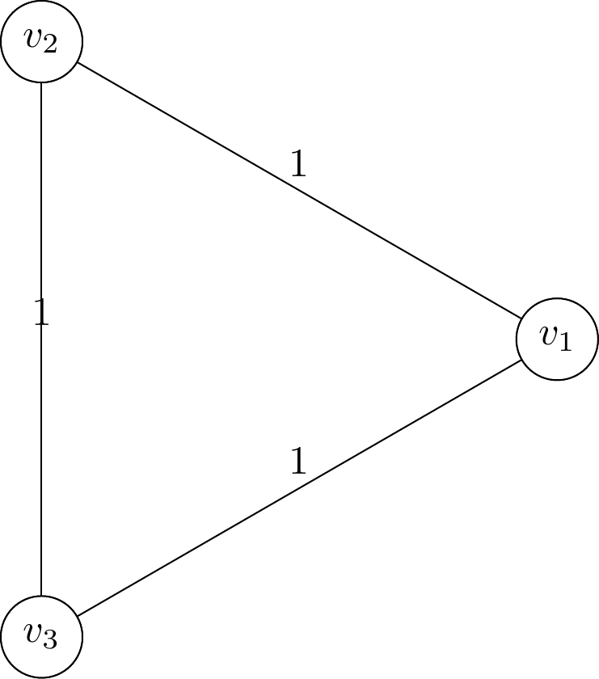
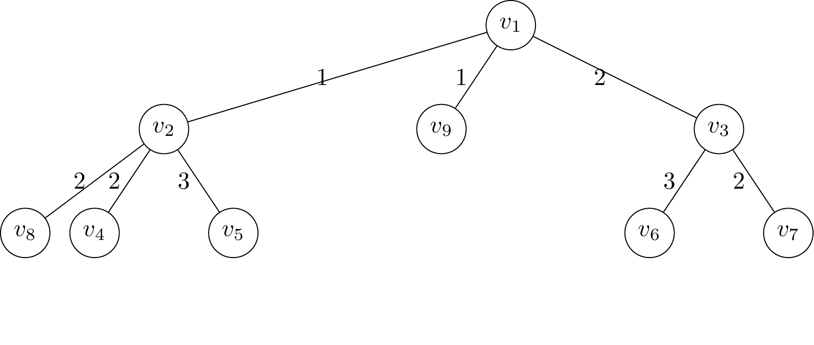

# Installation by pip

Install with pip:
```sh
pip install graph2img
```

Then write your edge information into ``graph.txt``. For example:
```
1 2 1
2 3 2
1 3 3
```

and run with:
```sh
graph2img graph.txt
```

This will return a file ``graph.png``:



# Installation from source
Draw graphs according to edges input.

You need to install xelatex before use.

To use it:
```sh
git clone https://github.com/ForwardStar/graph_drawer.git
cd graph_drawer
touch graph.txt
```

Then write your edge information into ``graph.txt``. For example:
```
1 2 1
2 3 2
1 3 3
```

This will return a triangular graph.

Then run the program:
```sh
python -u main.py graph.txt
```

This will return a file ``graph.png``:


## 10/02/2022 Update:
Now you can use the program to draw a tree:
```
1 2 1
1 3 2
2 4 2
2 5 3
3 6 3
3 7 2
1 9 1
2 8 2
```

This will return a tree:

