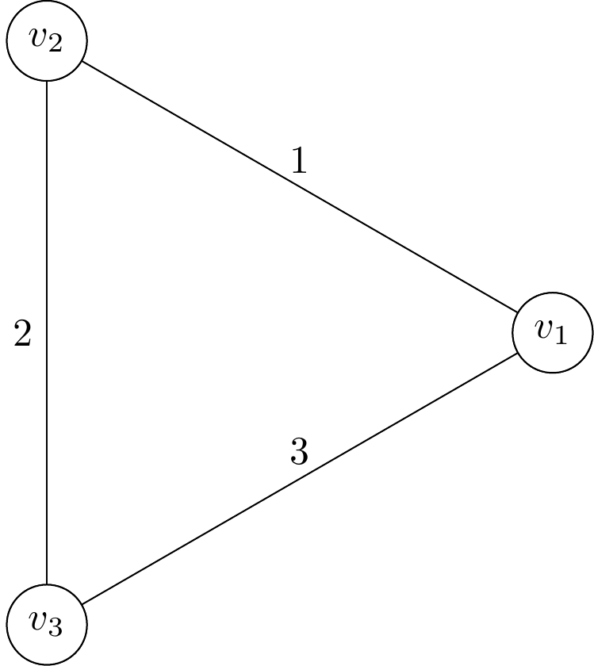

# graph_drawer
Draw graphs according to edges input.

You need to install xelatex before use.

To use it:
```sh
git clone https://github.com/ForwardStar/graph_drawer.git
cd graph_drawer
touch graph.txt
```

Then write your edge information into ``graph.txt``. For example:
```
1 2 1
2 3 2
1 3 3
```

This will return a triangular graph.

Then run the program:
```sh
python -u main.py graph.txt
```

This will return a file ``graph.png``:


